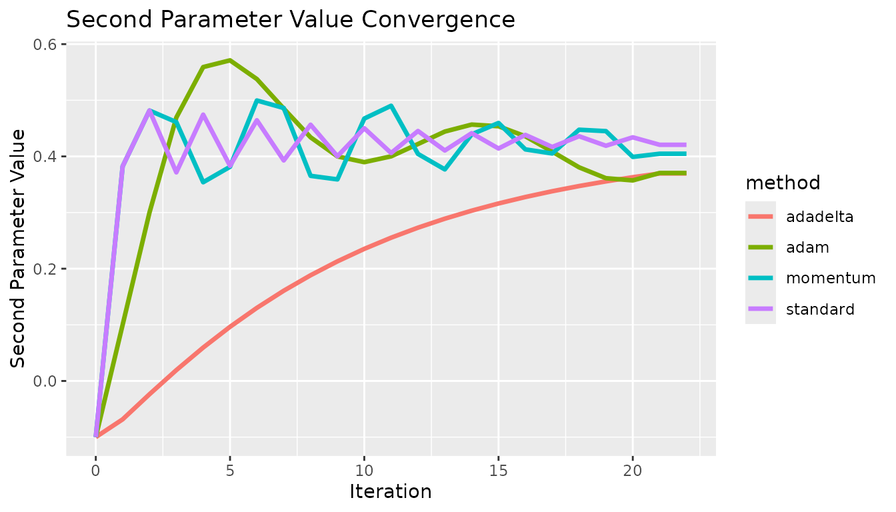
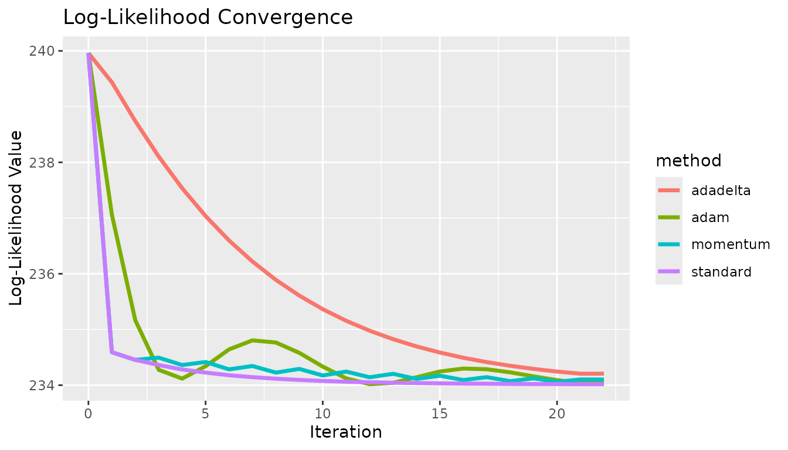

# Gradient and Hessian Approaches

``` r
Sys.setenv("OMP_THREAD_LIMIT" = 1) # Reducing core use, to avoid accidental use of too many cores
library(Colossus)
library(data.table)
```

## Optimization Theory

Colossus offers three levels of score calculation, calculating only the
score, calculating the score and first derivative, and calculating the
score and both first and second derivatives. The second and third
options correspond to the Gradient Descent and Newton-Raphson
optimization approaches. The goal of this vignette is to discuss how
these methods are different, and in what circumstances each might be
most appropriate. In both cases, the algorithm is designed to
iteratively change the parameter estimates to approach a set of
parameter values that optimize the score. The major difference is how
much information is being calculated and used. The Newton-Raphson
algorithm calculates the second derivative matrix, inverts it, and
solves a linear system of equations to set the first derivative vector
to zero. This method establishes both a magnitude and direction for
every step. So every step has several time-intensive calculations, but
the new parameter estimates are informed. In this algorithm, Colossus
uses both a learning rate ($\eta$) and maximum allowable parameter
change ($\beta_{max}$). Colossus uses half-steps to slowly reduce the
allowable step size as the solution approaches the optimum.

$$\begin{array}{r}
{\Delta\beta \times \frac{\partial^{2}LL}{\partial\beta^{2}} \approx - \frac{\partial LL}{\partial\beta}} \\
{\Delta\beta = - \eta\frac{\partial LL}{\partial\beta_{t}} \times \left( \frac{\partial^{2}LL}{\partial\beta_{t}^{2}} \right)^{- 1}} \\
{\beta_{t + 1} = \beta_{t} + sign(\Delta\beta)*min\left( \left\lbrack |\Delta\beta|,\beta_{max} \right\rbrack \right)}
\end{array}$$

The alternative is a Gradient descent approach. In this algorithm, the
first derivatives are calculated and used to determine the vector with
the highest change in score. This establishes a direction for the change
in parameters, which is multiplied by the learning rate ($\eta$).
Similar to the Newton-Raphson algorithm, the magnitude is limited by a
maximum allowable parameter change ($\beta_{max}$). The Gradient
algorithm avoids the time-intensive second-derivative calculations but
takes less informed steps. So each iteration runs faster, but more
iterations may be required.

$$\begin{array}{r}
{\Delta\beta = \eta*\frac{\partial LL}{\partial\beta}} \\
{\beta_{t + 1} = \beta_{t} + sign(\Delta\beta)*min\left( \left\lbrack |\Delta\beta|,\beta_{max} \right\rbrack \right)}
\end{array}$$

The standard half-step framework is not likely to be sufficient for the
Gradient descent algorithm. Because of this, several different
optimization options have been added: momentum, adadelta, and adam. Each
use previous information about the gradient to inform the step size for
future steps.

The first method, momentum, applies a weighted sum ($\gamma$) of the
current and the previous step. This is done to speed up steps moving
toward the optimum position and correct for when the algorithm
oversteps. This can avoid the issue of oscillation around an optimum
value.

$$\begin{array}{r}
{\Delta\beta_{t} = \gamma*\Delta\beta_{t - 1} + \eta*\frac{\partial LL}{\partial\beta}} \\
{\beta_{t + 1} = \beta_{t} + sign\left( \Delta\beta_{t} \right)*min\left( \left\lbrack \left| \Delta\beta_{t} \right|,\beta_{max} \right\rbrack \right)}
\end{array}$$

The next method, the adadelta method, applies a parameter-specific
learning rate by tracking the root mean square (RMS) gradient and
parameter updates within a window. Instead of tracking a true window of
iteration, the old estimate of RMS is decayed by a weight ($\gamma$)
before being added to the new estimate. The ratio of RMS parameter
update to RMS gradient is used to normalize the results back in the
correct units. A small offset ($\epsilon$) is used to avoid the case of
division by zero.

$$\begin{array}{r}
{g_{t} = \left( \frac{\partial LL}{\partial\beta} \right)_{t}} \\
{E\left\lbrack g^{2} \right\rbrack_{t} = \gamma*E\left\lbrack g^{2} \right\rbrack_{t - 1} + (1 - \gamma)*g_{t}^{2}} \\
{E\left\lbrack \Delta\beta^{2} \right\rbrack_{t - 1} = \gamma*E\left\lbrack \Delta\beta^{2} \right\rbrack_{t - 2} + (1 - \gamma)*\Delta\beta_{t - 1}^{2}} \\
{RMS\lbrack g\rbrack_{t} = \sqrt{E\left\lbrack g^{2} \right\rbrack_{t} + \epsilon}} \\
{RMS\lbrack\Delta\beta\rbrack_{t - 1} = \sqrt{E\left\lbrack \Delta\beta^{2} \right\rbrack_{t - 1} + \epsilon}} \\
{\Delta\beta_{t} = \frac{RMS\lbrack\Delta\beta\rbrack_{t - 1}}{RMS\lbrack g\rbrack_{t}}*g_{t}} \\
{\beta_{t + 1} = \beta_{t} + sign\left( \Delta\beta_{t} \right)*min\left( \left\lbrack \left| \Delta\beta_{t} \right|,\beta_{max} \right\rbrack \right)}
\end{array}$$

The final method, adam, combines the theory behind the momentum and
adadelta methods. The adam method tracks an estimate of the first moment
vector ($m$) and second moment vector ($v$), which are weighted by decay
parameters ($\beta_{1},\beta_{2}$). These are bias corrected to correct
for bias in early iterations ($\widehat{m},\widehat{v}$). The learning
rate ($\eta$) and second moment vector provide the decaying learning
rate from adadelta, and the first moment vector provides an effect
similar to momentum. Combined, these have generally been able to
stabilize gradient descent algorithms without incurring a significant
computational cost.

$$\begin{array}{r}
{g_{t} = \left( \frac{\partial LL}{\partial\beta} \right)_{t}} \\
{m_{0},v_{0} = 0,0} \\
{m_{t} = \beta_{1}*m_{t - 1} + \left( 1 - \beta_{1} \right)*g_{t}} \\
{v_{t} = \beta_{2}*v_{t - 1} + \left( 1 - \beta_{2} \right)*g_{t}^{2}} \\
{{\widehat{m}}_{t} = m_{t}/\left( 1 - \beta_{1}^{t} \right)} \\
{{\widehat{v}}_{t} = v_{t}/\left( 1 - \beta_{2}^{t} \right)} \\
{\Delta\beta_{t} = \frac{\eta}{\sqrt{{\widehat{v}}_{t}} + \epsilon}*{\widehat{m}}_{t}} \\
{\beta_{t + 1} = \beta_{t} + sign\left( \Delta\beta_{t} \right)*min\left( \left\lbrack \left| \Delta\beta_{t} \right|,\beta_{max} \right\rbrack \right)}
\end{array}$$

## Use in Practice

The first thing to acknowledge is that the gradient descent method may
require more hyperparameter tuning than the standard Newton-Raphson
method. In general, it may be necessary to run the analysis multiple
times with different learning rates, decay terms, and offsets. The
following test example shows the basic usage with a simple model.

``` r
fname <- "tests/testthat/ll_comp_0.csv"
colTypes <- c("double", "double", "double", "integer", "integer")
df <- fread(fname, nThread = 1, data.table = TRUE, header = TRUE, colClasses = colTypes, verbose = 2, fill = TRUE)
set.seed(3742)
df$rand <- floor(runif(nrow(df), min = 0, max = 5))

a_n <- c(-0.1, -0.1)
keep_constant <- c(0, 0)

# Code not run due to duration
for (method in c("momentum", "adadelta", "adam", "gradient")) {
  gradient_control <- list("epsilon_decay" = 1e-4)
  gradient_control[[method]] <- TRUE
  a_n <- c(-0.1, -0.1)
  control <- list(
    "ncores" = 1, "lr" = 0.2, "maxiters" = c(1, 20),
    "halfmax" = 2, "epsilon" = 1e-6,
    "deriv_epsilon" = 1e-6, "verbose" = 4
  )
  e <- CoxRun(Cox(t0, t1, lung) ~ loglinear(dose, rand, 0) + m(), df,
    a_n = a_n, keep_constant = keep_constant,
    control = control, gradient_control = gradient_control
  )
  print(e)
}
```

Every gradient descent algorithm available was tested at the same
starting point. In all cases, the algorithm approaches the solution at
different rates. In this case, there are no local extrema, so the
standard approach is fine. These show some fundamental differences
between the methods. The effect of momentum is apparent compared to the
standard option, the estimates do not oscillate as quickly. The
differences between adadelta and adam are also visible, the adam method
converged quicker. These results did not necessarily use optimized
hyperparameters, and this is not meant to prove which method was the
best.

``` r
x <- c(0, 1, 2, 3, 4, 5, 6, 7, 8, 9, 10, 11, 12, 13, 14, 15, 16, 17, 18, 19, 20, 21, 22, 0, 1, 2, 3, 4, 5, 6, 7, 8, 9, 10, 11, 12, 13, 14, 15, 16, 17, 18, 19, 20, 21, 22, 0, 1, 2, 3, 4, 5, 6, 7, 8, 9, 10, 11, 12, 13, 14, 15, 16, 17, 18, 19, 20, 21, 22, 0, 1, 2, 3, 4, 5, 6, 7, 8, 9, 10, 11, 12, 13, 14, 15, 16, 17, 18, 19, 20, 21, 22)
y <- c(-0.1, 0.9, 0.446528, 0.839821, 0.493552, 0.799313, 0.528609, 0.768118, 0.555872, 0.743827, 0.577191, 0.724839, 0.593904, 0.70996, 0.607026, 0.698284, 0.617337, 0.689114, 0.625445, 0.681907, 0.631822, 0.67624, 0.67624, -0.1, 0.9, 0.446528, 0.431696, 0.834161, 0.857333, 0.501858, 0.477865, 0.793264, 0.814217, 0.531039, 0.511871, 0.770217, 0.78877, 0.55277, 0.530413, 0.745479, 0.771659, 0.578773, 0.54938, 0.72037, 0.750178, 0.750178, -0.1, -0.0683777, -0.0236573, 0.0204036, 0.0631351, 0.104199, 0.143407, 0.180661, 0.215914, 0.249159, 0.280419, 0.309735, 0.337162, 0.362769, 0.386631, 0.408828, 0.429444, 0.448562, 0.466269, 0.482647, 0.497779, 0.511745, 0.511745, -0.1, 0.0999967, 0.299992, 0.49416, 0.672686, 0.818272, 0.912721, 0.951325, 0.943139, 0.900966, 0.836339, 0.759197, 0.678706, 0.6037, 0.542181, 0.50002, 0.479848, 0.481022, 0.500511, 0.53392, 0.576232, 0.622276, 0.622276)
c <- c("standard", "standard", "standard", "standard", "standard", "standard", "standard", "standard", "standard", "standard", "standard", "standard", "standard", "standard", "standard", "standard", "standard", "standard", "standard", "standard", "standard", "standard", "standard", "momentum", "momentum", "momentum", "momentum", "momentum", "momentum", "momentum", "momentum", "momentum", "momentum", "momentum", "momentum", "momentum", "momentum", "momentum", "momentum", "momentum", "momentum", "momentum", "momentum", "momentum", "momentum", "momentum", "adadelta", "adadelta", "adadelta", "adadelta", "adadelta", "adadelta", "adadelta", "adadelta", "adadelta", "adadelta", "adadelta", "adadelta", "adadelta", "adadelta", "adadelta", "adadelta", "adadelta", "adadelta", "adadelta", "adadelta", "adadelta", "adadelta", "adadelta", "adam", "adam", "adam", "adam", "adam", "adam", "adam", "adam", "adam", "adam", "adam", "adam", "adam", "adam", "adam", "adam", "adam", "adam", "adam", "adam", "adam", "adam", "adam")

df <- data.table("x" = x, "y" = y, "method" = c)

g <- ggplot2::ggplot(df, ggplot2::aes(x = .data$x, y = .data$y, group = .data$method, color = .data$method)) +
  ggplot2::geom_line("linewidth" = 1.2) +
  ggplot2::labs(x = "Iteration", y = "First Parameter Value") +
  ggplot2::ggtitle("First Parameter Value Convergence")
g
```


``` r
x <- c(0, 1, 2, 3, 4, 5, 6, 7, 8, 9, 10, 11, 12, 13, 14, 15, 16, 17, 18, 19, 20, 21, 22, 0, 1, 2, 3, 4, 5, 6, 7, 8, 9, 10, 11, 12, 13, 14, 15, 16, 17, 18, 19, 20, 21, 22, 0, 1, 2, 3, 4, 5, 6, 7, 8, 9, 10, 11, 12, 13, 14, 15, 16, 17, 18, 19, 20, 21, 22, 0, 1, 2, 3, 4, 5, 6, 7, 8, 9, 10, 11, 12, 13, 14, 15, 16, 17, 18, 19, 20, 21, 22)
y <- c(-0.1, 0.382267, 0.481728, 0.371577, 0.474396, 0.383262, 0.464408, 0.392812, 0.456452, 0.40023, 0.45019, 0.406007, 0.445259, 0.41052, 0.441374, 0.414052, 0.438314, 0.416821, 0.435902, 0.418993, 0.434002, 0.420699, 0.420699, -0.1, 0.382267, 0.481728, 0.461092, 0.353981, 0.381487, 0.499642, 0.486223, 0.365388, 0.35904, 0.467404, 0.490215, 0.404434, 0.37681, 0.439266, 0.459563, 0.412495, 0.405195, 0.44752, 0.445014, 0.399118, 0.404763, 0.404763, -0.1, -0.0683799, -0.0236649, 0.0193058, 0.0594837, 0.0964731, 0.130195, 0.160739, 0.188284, 0.213051, 0.235278, 0.255201, 0.273049, 0.289032, 0.303346, 0.316169, 0.327659, 0.337961, 0.347201, 0.355493, 0.36294, 0.36963, 0.36963, -0.1, 0.0999917, 0.299977, 0.469249, 0.559129, 0.571139, 0.537754, 0.485171, 0.434002, 0.399975, 0.38974, 0.400107, 0.422011, 0.444253, 0.456706, 0.453734, 0.435816, 0.40853, 0.380544, 0.36118, 0.357234, 0.370462, 0.370462)
c <- c("standard", "standard", "standard", "standard", "standard", "standard", "standard", "standard", "standard", "standard", "standard", "standard", "standard", "standard", "standard", "standard", "standard", "standard", "standard", "standard", "standard", "standard", "standard", "momentum", "momentum", "momentum", "momentum", "momentum", "momentum", "momentum", "momentum", "momentum", "momentum", "momentum", "momentum", "momentum", "momentum", "momentum", "momentum", "momentum", "momentum", "momentum", "momentum", "momentum", "momentum", "momentum", "adadelta", "adadelta", "adadelta", "adadelta", "adadelta", "adadelta", "adadelta", "adadelta", "adadelta", "adadelta", "adadelta", "adadelta", "adadelta", "adadelta", "adadelta", "adadelta", "adadelta", "adadelta", "adadelta", "adadelta", "adadelta", "adadelta", "adadelta", "adam", "adam", "adam", "adam", "adam", "adam", "adam", "adam", "adam", "adam", "adam", "adam", "adam", "adam", "adam", "adam", "adam", "adam", "adam", "adam", "adam", "adam", "adam")

df <- data.table("x" = x, "y" = y, "method" = c)

g <- ggplot2::ggplot(df, ggplot2::aes(x = .data$x, y = .data$y, group = .data$method, color = .data$method)) +
  ggplot2::geom_line("linewidth" = 1.2) +
  ggplot2::labs(x = "Iteration", y = "Second Parameter Value") +
  ggplot2::ggtitle("Second Parameter Value Convergence")
g
```


``` r
x <- c(0, 1, 2, 3, 4, 5, 6, 7, 8, 9, 10, 11, 12, 13, 14, 15, 16, 17, 18, 19, 20, 21, 22, 0, 1, 2, 3, 4, 5, 6, 7, 8, 9, 10, 11, 12, 13, 14, 15, 16, 17, 18, 19, 20, 21, 22, 0, 1, 2, 3, 4, 5, 6, 7, 8, 9, 10, 11, 12, 13, 14, 15, 16, 17, 18, 19, 20, 21, 22, 0, 1, 2, 3, 4, 5, 6, 7, 8, 9, 10, 11, 12, 13, 14, 15, 16, 17, 18, 19, 20, 21, 22)
y <- c(239.962, 234.592, 234.454, 234.362, 234.282, 234.226, 234.178, 234.144, 234.116, 234.094, 234.076, 234.062, 234.052, 234.044, 234.038, 234.032, 234.028, 234.026, 234.022, 234.02, 234.02, 234.018, 234.018, 239.962, 234.592, 234.454, 234.494, 234.362, 234.416, 234.284, 234.344, 234.226, 234.292, 234.174, 234.244, 234.142, 234.204, 234.112, 234.17, 234.092, 234.144, 234.072, 234.122, 234.06, 234.102, 234.102, 239.962, 239.438, 238.74, 238.104, 237.536, 237.036, 236.598, 236.22, 235.89, 235.608, 235.364, 235.156, 234.978, 234.826, 234.696, 234.586, 234.492, 234.414, 234.348, 234.292, 234.244, 234.206, 234.206, 239.962, 237.064, 235.166, 234.276, 234.118, 234.34, 234.642, 234.804, 234.766, 234.58, 234.334, 234.122, 234.018, 234.042, 234.142, 234.246, 234.298, 234.286, 234.23, 234.158, 234.09, 234.04, 234.04)
c <- c("standard", "standard", "standard", "standard", "standard", "standard", "standard", "standard", "standard", "standard", "standard", "standard", "standard", "standard", "standard", "standard", "standard", "standard", "standard", "standard", "standard", "standard", "standard", "momentum", "momentum", "momentum", "momentum", "momentum", "momentum", "momentum", "momentum", "momentum", "momentum", "momentum", "momentum", "momentum", "momentum", "momentum", "momentum", "momentum", "momentum", "momentum", "momentum", "momentum", "momentum", "momentum", "adadelta", "adadelta", "adadelta", "adadelta", "adadelta", "adadelta", "adadelta", "adadelta", "adadelta", "adadelta", "adadelta", "adadelta", "adadelta", "adadelta", "adadelta", "adadelta", "adadelta", "adadelta", "adadelta", "adadelta", "adadelta", "adadelta", "adadelta", "adam", "adam", "adam", "adam", "adam", "adam", "adam", "adam", "adam", "adam", "adam", "adam", "adam", "adam", "adam", "adam", "adam", "adam", "adam", "adam", "adam", "adam", "adam")

df <- data.table("x" = x, "y" = y, "method" = c)

g <- ggplot2::ggplot(df, ggplot2::aes(x = .data$x, y = .data$y, group = .data$method, color = .data$method)) +
  ggplot2::geom_line("linewidth" = 1.2) +
  ggplot2::labs(x = "Iteration", y = "Log-Likelihood Value") +
  ggplot2::ggtitle("Log-Likelihood Convergence")
g
```



### Hyper-parameter Tuning Examples

First, a brief comparison of learning rates with the standard gradient
descent method. For this analysis, the gradient was on the scale of
(-2,2) so a learning rate on the scale of ~ 1/10 was appropriate. If the
gradient were much larger then the learning rate would need to be
correspondingly decreased. If the learning rate is too high, then the
estimate will be unstable and oscillate. If the learning rate is too low
then the estimate will not converge in a reasonable amount of time.

``` r
x <- c(0, 1, 2, 3, 4, 5, 6, 7, 8, 9, 10, 11, 12, 13, 14, 15, 16, 17, 18, 19, 20, 21, 22, 0, 1, 2, 3, 4, 5, 6, 7, 8, 9, 10, 11, 12, 13, 14, 15, 16, 17, 18, 19, 0, 1, 2, 3, 4, 5, 6, 7, 8, 9, 10, 11, 12, 13, 14, 15, 16, 17, 18, 19, 20, 21, 22, 0, 1, 2, 3, 4, 5, 6, 7, 8, 9, 10, 11, 12, 13, 14, 15, 16, 17, 18, 19, 20, 21, 22)
y <- c(-0.1, -0.0758866, -0.0524678, -0.0297801, -0.00784991, 0.0133049, 0.0336744, 0.053255, 0.0720488, 0.0900628, 0.107308, 0.123797, 0.139549, 0.154581, 0.168914, 0.18257, 0.195571, 0.207941, 0.219702, 0.230879, 0.241495, 0.251573, 0.251573, -0.1, 0.141134, 0.305602, 0.376672, 0.406159, 0.418355, 0.423402, 0.425492, 0.426358, 0.426717, 0.426865, 0.426927, 0.426952, 0.426963, 0.426967, 0.426969, 0.42697, 0.42697, 0.42697, 0.42697, -0.1, 0.382267, 0.481728, 0.371577, 0.474396, 0.383262, 0.464408, 0.392812, 0.456452, 0.40023, 0.45019, 0.406007, 0.445259, 0.41052, 0.441374, 0.414052, 0.438314, 0.416821, 0.435902, 0.418993, 0.434002, 0.420699, 0.420699, -0.1, 0.9, -0.1, 0.9, -0.1, 0.9, -0.1, 0.9, -0.1, 0.9, -0.1, 0.9, -0.1, 0.9, -0.1, 0.9, -0.1, 0.9, -0.1, 0.9, -0.1, 0.9, 0.9)
c <- c("0.01", "0.01", "0.01", "0.01", "0.01", "0.01", "0.01", "0.01", "0.01", "0.01", "0.01", "0.01", "0.01", "0.01", "0.01", "0.01", "0.01", "0.01", "0.01", "0.01", "0.01", "0.01", "0.01", "0.1", "0.1", "0.1", "0.1", "0.1", "0.1", "0.1", "0.1", "0.1", "0.1", "0.1", "0.1", "0.1", "0.1", "0.1", "0.1", "0.1", "0.1", "0.1", "0.1", "0.2", "0.2", "0.2", "0.2", "0.2", "0.2", "0.2", "0.2", "0.2", "0.2", "0.2", "0.2", "0.2", "0.2", "0.2", "0.2", "0.2", "0.2", "0.2", "0.2", "0.2", "0.2", "0.2", "0.5", "0.5", "0.5", "0.5", "0.5", "0.5", "0.5", "0.5", "0.5", "0.5", "0.5", "0.5", "0.5", "0.5", "0.5", "0.5", "0.5", "0.5", "0.5", "0.5", "0.5", "0.5", "0.5")

df <- data.table("x" = x, "y" = y, "LearningRate" = c)

g <- ggplot2::ggplot(df, ggplot2::aes(x = .data$x, y = .data$y, group = .data$LearningRate, color = .data$LearningRate)) +
  ggplot2::geom_line("linewidth" = 1.2) +
  ggplot2::labs(x = "Iteration", y = "Second Parameter") +
  ggplot2::ggtitle("Second Parameter Convergence")
g
```



Next, the momentum decay. The momentum decay term is helpful
particularly when the standard method overshoots the solution. In this
example, the standard method at a learning rate of 0.1 has no issue
overshooting the solution, so the momentum method was tested at a
learning rate of 0.2 to induce oscillation. At a learning rate of 0.0,
we have the standard gradient descent and as we increase the momentum
effect we see faster convergence.

``` r
x <- c(0, 1, 2, 3, 4, 5, 6, 7, 8, 9, 10, 11, 12, 13, 14, 15, 16, 17, 18, 19, 20, 21, 22, 0, 1, 2, 3, 4, 5, 6, 7, 8, 9, 10, 11, 12, 13, 14, 15, 16, 17, 18, 19, 20, 21, 0, 1, 2, 3, 4, 5, 6, 7, 8, 9, 10, 11, 12, 13, 14, 15, 16, 17, 18, 19, 20, 21, 22)
y <- c(-0.1, 0.382267, 0.481728, 0.371577, 0.474396, 0.383262, 0.464408, 0.392812, 0.456452, 0.40023, 0.45019, 0.406007, 0.445259, 0.41052, 0.441374, 0.414052, 0.438314, 0.416821, 0.435902, 0.418993, 0.434002, 0.420699, 0.420699, -0.1, 0.382267, 0.481728, 0.391469, 0.435244, 0.429155, 0.424804, 0.427892, 0.426568, 0.427082, 0.427015, 0.426915, 0.426992, 0.426967, 0.42697, 0.426971, 0.42697, 0.426971, 0.42697, 0.42697, 0.426971, 0.426971, -0.1, 0.382267, 0.481728, 0.421307, 0.389624, 0.442182, 0.445048, 0.414796, 0.420771, 0.433596, 0.427802, 0.424361, 0.427741, 0.42752, 0.426131, 0.427168, 0.427483, 0.426655, 0.426746, 0.427195, 0.427034, 0.426856, 0.426856)
c <- c("0.0", "0.0", "0.0", "0.0", "0.0", "0.0", "0.0", "0.0", "0.0", "0.0", "0.0", "0.0", "0.0", "0.0", "0.0", "0.0", "0.0", "0.0", "0.0", "0.0", "0.0", "0.0", "0.0", "0.2", "0.2", "0.2", "0.2", "0.2", "0.2", "0.2", "0.2", "0.2", "0.2", "0.2", "0.2", "0.2", "0.2", "0.2", "0.2", "0.2", "0.2", "0.2", "0.2", "0.2", "0.2", "0.5", "0.5", "0.5", "0.5", "0.5", "0.5", "0.5", "0.5", "0.5", "0.5", "0.5", "0.5", "0.5", "0.5", "0.5", "0.5", "0.5", "0.5", "0.5", "0.5", "0.5", "0.5", "0.5")

df <- data.table("x" = x, "y" = y, "MomentumDecay" = c)

g <- ggplot2::ggplot(df, ggplot2::aes(x = .data$x, y = .data$y, group = .data$MomentumDecay, color = .data$MomentumDecay)) +
  ggplot2::geom_line("linewidth" = 1.2) +
  ggplot2::labs(x = "Iteration", y = "Second Parameter") +
  ggplot2::ggtitle("Second Parameter Convergence")
g
```


Finally, we have the epsilon offset used in the adadelta method. In this
example, if the offset is too low the change in parameter value per
iteration is near zero, then as it is increased the algorithm converges
faster until the estimate oscillates.

``` r
x <- c(0, 1, 2, 3, 4, 5, 6, 7, 8, 9, 10, 11, 12, 13, 14, 15, 16, 17, 18, 19, 20, 21, 22, 0, 1, 2, 3, 4, 5, 6, 7, 8, 9, 10, 11, 12, 13, 14, 15, 16, 17, 18, 19, 20, 21, 22, 0, 1, 2, 3, 4, 5, 6, 7, 8, 9, 10, 11, 12, 13, 14, 15, 16, 17, 18, 19, 20, 21, 22, 0, 1, 2, 3, 4, 5, 6, 7, 8, 9, 10, 11, 12, 13, 14, 15, 16, 17, 18, 19, 20, 21, 22)
y <- c(-0.1, -0.0998946, -0.0997455, -0.0995686, -0.0993678, -0.0991457, -0.0989042, -0.0986448, -0.0983686, -0.0980766, -0.0977695, -0.0974482, -0.0971132, -0.096765, -0.0964041, -0.0960311, -0.0956462, -0.0952498, -0.0948422, -0.0944238, -0.0939948, -0.0935554, -0.0935554, -0.1, -0.0894592, -0.0745523, -0.0569106, -0.0369613, -0.0149815, 0.00881833, 0.0342662, 0.0612136, 0.0895258, 0.119075, 0.149732, 0.181361, 0.213808, 0.246885, 0.280336, 0.313768, 0.346445, 0.376444, 0.393247, 0.380437, 0.397974, 0.397974, -0.1, -0.0666699, -0.0195369, 0.0357806, 0.0976085, 0.164622, 0.235362, 0.307561, 0.375392, 0.39949, 0.393904, 0.42769, 0.416127, 0.448594, 0.412644, 0.445826, 0.410436, 0.445034, 0.409797, 0.444717, 0.409586, 0.444599, 0.444599, -0.1, 0.00530869, 0.154075, 0.317511, 0.438734, 0.311745, 0.479287, 0.359676, 0.509816, 0.380595, 0.519051, 0.390015, 0.516403, 0.39013, 0.51552, 0.389794, 0.484692, 0.374198, 0.483729, 0.372471, 0.483021, 0.372011, 0.372011)
c <- c("1e-8", "1e-8", "1e-8", "1e-8", "1e-8", "1e-8", "1e-8", "1e-8", "1e-8", "1e-8", "1e-8", "1e-8", "1e-8", "1e-8", "1e-8", "1e-8", "1e-8", "1e-8", "1e-8", "1e-8", "1e-8", "1e-8", "1e-8", "1e-4", "1e-4", "1e-4", "1e-4", "1e-4", "1e-4", "1e-4", "1e-4", "1e-4", "1e-4", "1e-4", "1e-4", "1e-4", "1e-4", "1e-4", "1e-4", "1e-4", "1e-4", "1e-4", "1e-4", "1e-4", "1e-4", "1e-4", "1e-3", "1e-3", "1e-3", "1e-3", "1e-3", "1e-3", "1e-3", "1e-3", "1e-3", "1e-3", "1e-3", "1e-3", "1e-3", "1e-3", "1e-3", "1e-3", "1e-3", "1e-3", "1e-3", "1e-3", "1e-3", "1e-3", "1e-3", "1e-2", "1e-2", "1e-2", "1e-2", "1e-2", "1e-2", "1e-2", "1e-2", "1e-2", "1e-2", "1e-2", "1e-2", "1e-2", "1e-2", "1e-2", "1e-2", "1e-2", "1e-2", "1e-2", "1e-2", "1e-2", "1e-2", "1e-2")

df <- data.table("x" = x, "y" = y, "Epsilon" = c)

g <- ggplot2::ggplot(df, ggplot2::aes(x = .data$x, y = .data$y, group = .data$Epsilon, color = .data$Epsilon)) +
  ggplot2::geom_line("linewidth" = 1.2) +
  ggplot2::labs(x = "Iteration", y = "Second Parameter") +
  ggplot2::ggtitle("Second Parameter Convergence")
g
```


