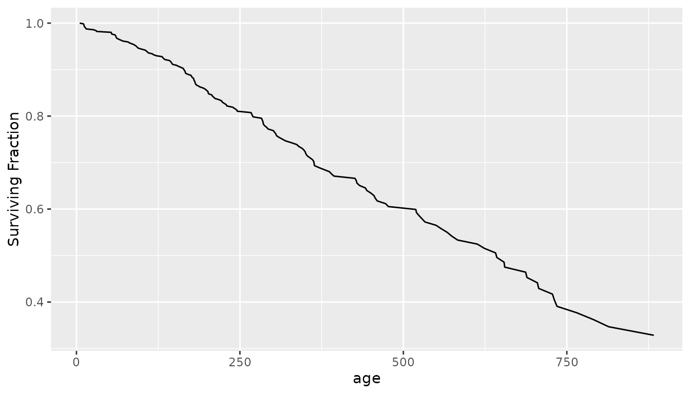
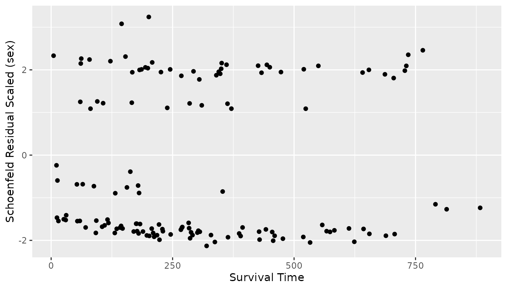
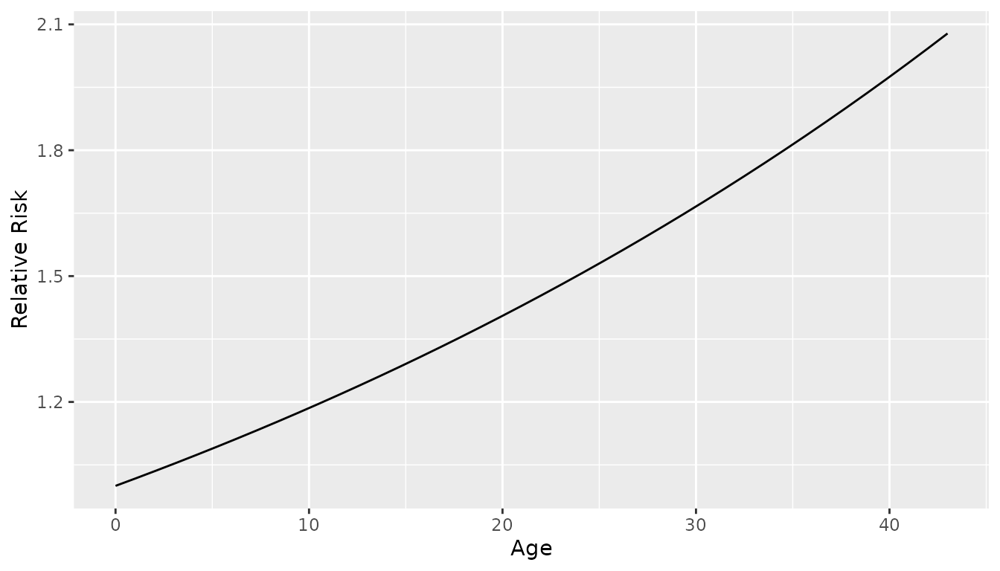

# Functions for Plotting and Analysis

``` r
Sys.setenv("OMP_THREAD_LIMIT" = 1) # Reducing core use, to avoid accidental use of too many cores
library(Colossus)
library(data.table)
library(survival)
library(dplyr)
#> 
#> Attaching package: 'dplyr'
#> The following objects are masked from 'package:data.table':
#> 
#>     between, first, last
#> The following objects are masked from 'package:stats':
#> 
#>     filter, lag
#> The following objects are masked from 'package:base':
#> 
#>     intersect, setdiff, setequal, union
library(ggplot2)
```

## Example Setup

We will use analysis of the lung dataset in the survival package to
visualize the different plotting methods available in Colossus.

``` r
data(cancer, package = "survival")
cancer %>% setDT()
df <- copy(cancer)

df$UserID <- seq_len(nrow(df))

df$status <- df$status - 1
df$sex <- df$sex - 1

control <- list(ncore = 1)
a_n <- c(0.01701289, -0.51256478)
coxres <- CoxRun(Cox(time, status) ~ loglinear(age, sex, 0),
  df,
  control = control, a_n = a_n
)
```

## Survival Function Approximation

After fitting a Cox proportional hazards model, one may be interested in
what the baseline survival rate is. One method of doing so is by
weighting the number of events at each event time by the total risk. In
the absence of excess risk, the hazard at any point in time is equal to
the event rate and the hazard ratio of every row is equal to one, so
this assumption holds for the case with negligible excess risk.

$$\begin{array}{r}
{\lambda(t) = \frac{d\lbrack t\rbrack}{n\lbrack t\rbrack} = \frac{d\lbrack t\rbrack}{\sum\limits_{i = 1}^{n}(1)} = \frac{d\lbrack t\rbrack}{\sum\limits_{i = 1}^{n}\left( r_{i} \right)}}
\end{array}$$

Suppose every row at risk at a time was twice as likely to experience an
event than the baseline. Then we would expect there to be twice as many
events as there would be at baseline. The same logic applies to the case
with every row at risk being half as likely. This generalizes to any
average risk. Colossus allows the instantaneous hazard to be
approximated for both stratified and non-stratified models.

$$\begin{array}{r}
{\lambda(t) = \frac{d\lbrack t\rbrack}{\sum\limits_{i = 1}^{n}\left( r_{i} \right)} = \frac{d\lbrack t\rbrack}{\sum\limits_{i = 1}^{n}(2)} = \frac{d\lbrack t\rbrack/2}{n\lbrack t\rbrack}} \\
{\lambda(t) = \frac{d\lbrack t\rbrack}{\sum\limits_{i = 1}^{n}\left( r_{i} \right)} = \frac{d\lbrack t\rbrack}{\sum\limits_{i = 1}^{n}(0.5)} = \frac{d\lbrack t\rbrack*2}{n\lbrack t\rbrack}}
\end{array}$$

Once the instantaneous hazard is approximated, the cumulative hazard can
be approximated. Then the surviving fraction is approximately equal to
the exponential of the negative cumulative hazard at each event time.

$$\begin{array}{r}
{\Lambda(t) = \int_{0}^{t}\left( \lambda(x)dx \right)} \\
{S(t) = \exp\left( - \Lambda(t) \right)}
\end{array}$$

``` r
plot_options <- list(
  "fname" = paste(tempfile(), "run", sep = ""), "studyid" = "UserID",
  "verbose" = 2, "surv_curv" = T, "martingale" = F, "strat_haz" = F, "km" = F
)

e <- plotSurvival(coxres, df, plot_options)

norm_surv <- e[["standard"]]

g <- ggplot(norm_surv, aes(x = .data$t, y = .data$h)) +
  geom_point(color = "black") +
  labs(x = "age", y = "Instantaneous Hazard")
g
```


``` r
g <- ggplot(norm_surv, aes(x = .data$t, y = .data$ch)) +
  geom_line(color = "black", alpha = 1) +
  labs(x = "age", y = "Cumulative Hazard")
g
```


``` r
g <- ggplot(norm_surv, aes(x = .data$t, y = .data$surv)) +
  geom_line(color = "black", alpha = 1) +
  labs(x = "age", y = "Surviving Fraction")
g
```



``` r
plot_options <- list(
  "fname" = paste(tempfile(), "run", sep = ""), "studyid" = "UserID",
  "verbose" = 2, "surv_curv" = F, "martingale" = F, "strat_haz" = F, "km" = T
)

e <- plotSurvival(coxres, df, plot_options)

km <- e[["kaplin-meier"]]
g <- ggplot(km, aes(x = .data$t_t, y = .data$n_t)) +
  geom_line(color = "black", alpha = 1) +
  labs(x = "age", y = "KM Survival")
g
```


## Cox Proportional Hazards model assumptions

The Cox proportional hazards model by definition assumes proportional
hazards independent of time. If this is violated, then the results of a
regression may be misleading. There are two checks that Colossus
provides that can be used to test this assumption, the Schoenfeld
residuals and Martingale residuals. In both cases, the premise is that
if the hazard ratio were independent of time, then the residuals should
also be independent of time.

### Schoenfeld Residuals

Schoenfeld residuals compare the average covariate value of rows with
events with the risk-weighted average of the covariate in rows at risk.
Consistently high or low residuals may be due to the hazard being much
higher or lower than the model predicts. If these residuals are also
correlated with event time, then the hazard ratio may be dependent on
event time. There is also the option to scale the residuals by the
standard deviation.

$$\begin{array}{r}
{s(t,x) = \frac{\sum\limits_{i \in events}x_{i}}{d\lbrack t\rbrack} - \frac{\sum\limits_{i}^{n}x_{i}*r_{i}}{\sum\limits_{i}^{n}r_{i}}}
\end{array}$$

``` r
plot_options <- list(
  "fname" = paste(tempfile(), "run", sep = ""),
  "studyid" = "UserID", "verbose" = 2
)

res_all <- plotSchoenfeld(coxres, df, plot_options)

res_age <- res_all[["age"]]

g <- ggplot(res_age, aes(x = .data$time, y = .data$y)) +
  geom_point(color = "black") +
  labs(
    x = paste("Survival Time", sep = ""),
    y = paste("Schoenfeld Residual (age)", sep = " ")
  )
g
```


``` r
g <- ggplot(res_age, aes(x = .data$time, y = .data$y_scale)) +
  geom_point(color = "black") +
  labs(
    x = paste("Survival Time", sep = ""),
    y = paste("Schoenfeld Residual Scaled (age)", sep = " ")
  )
g
```


``` r
res_sex <- res_all[["sex"]]

g <- ggplot(res_sex, aes(x = .data$time, y = .data$y)) +
  geom_point(color = "black") +
  labs(
    x = paste("Survival Time", sep = ""),
    y = paste("Schoenfeld Residual (sex)", sep = " ")
  )
g
```


``` r
g <- ggplot(res_sex, aes(x = .data$time, y = .data$y_scale)) +
  geom_point(color = "black") +
  labs(
    x = paste("Survival Time", sep = ""),
    y = paste("Schoenfeld Residual Scaled (sex)", sep = " ")
  )
g
```



### Martingale Residuals

Martingale residuals compare the event status and cumulative hazard for
each subject. The residual is bound in the open interval
$( - \infty,1)$. Negative residuals correspond with subjects that
survive despite high cumulative hazard and residuals near unity
correspond with subjects that experienced an event despite low
cumulative hazard. The distribution of residuals with event time can
indicate if the model is over-predicting or under-predicting dependent
on time.

$$\begin{array}{r}
{m_{j} = \delta_{j} - \int_{t_{0}}^{t_{1}}\lambda(t)*r_{j}dt}
\end{array}$$

``` r
plot_options <- list(
  "fname" = paste(tempfile(), "run", sep = ""),
  "studyid" = "UserID", "verbose" = 2, "surv_curv" = F,
  "martingale" = T, "strat_haz" = F, "km" = F, "cov_cols" = c("age", "sex")
)
res_all <- plotMartingale(coxres, df, plot_options)

res_age <- res_all[["age"]]

g <- ggplot() +
  geom_point(
    data = res_age,
    aes(x = .data$cov_max, y = .data$res_sum, group = .data$event, color = .data$event)
  )
g <- g + labs(x = "Max Age", y = "Martingale Residuals")
g
```


``` r
res_sex <- res_all[["sex"]]
g <- ggplot() +
  geom_point(
    data = res_sex,
    aes(x = .data$cov_max, y = .data$res_sum, group = .data$event, color = .data$event)
  )
g <- g + labs(x = "Sex", y = "Martingale Residuals")
g
```


``` r
res_surv <- res_all[["survival_time"]]
g <- ggplot() +
  geom_point(
    data = res_surv,
    aes(x = .data$time_max, y = .data$res_sum, group = .data$event, color = .data$event)
  )
g <- g + labs(x = "Survival Time", y = "Martingale Residuals")
g
```


## General Evaluation of Risk

Colossus also offers scripts that plot the relative risk by covariate
value for each covariate in the model, assuming every other covariate is
zero. Results for specific covariates can be requested by passing an
optional arguement, otherwise every covariate used in the risk model is
included. Risk at wald confidence interval boundaries can also be
calculated by including a ‘boundary’ option set to a z-score. In this
example, 95 percent confidence intervals are included and plotted.

``` r
plot_options <- list(
  "fname" = paste(tempfile(), "run", sep = ""), "studyid" = "UserID",
  "verbose" = 2, "cov_cols" = c("age", "sex"), boundary = 1.96
)
res_all <- plotRisk(coxres, df, plot_options)

res_age <- res_all[["age"]]

g <- ggplot(res_age, aes(x = .data$x, y = .data$y)) +
  geom_errorbar(aes(ymin = .data$"y:lower", ymax = .data$"y:upper"), color = "black") +
  geom_point(color = "black") +
  labs(x = "Age", y = "Relative Risk")
g
```



``` r


res_sex <- res_all[["sex"]]
g <- ggplot(res_sex, aes(x = .data$x, y = .data$y)) +
  geom_errorbar(aes(ymin = .data$"y:lower", ymax = .data$"y:upper"), color = "black") +
  geom_point(color = "black") +
  labs(x = "Sex", y = "Relative Risk")
g
```


